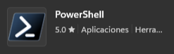
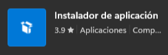

# Development Environment in Windows

Development Environment Setup on Windows **(only for Windows 11)**. 

This repository contains the following explanatory syllabus to prepare the development environment with the following tools:

- Windows Terminal with Oh My Posh and Terminal Icons.
    1. Install winget.
    2. Install Oh My Posh.
    3. Install fonts for terminal.
    4. Start Oh My Posh with default theme.
    5. Set Theme in Oh My Posh.
    6. Install Terminal Icons.
    7. Enable the PSReadLine module.
- Install development tools.
    1. Install web browsers for development.
        - Install Google Chrome Dev (optional).
        - Install Firefox Developer Edition (recommended).
    2. Install VSCode 
- Windows Subsystem for Linux 2 enabled with Ubuntu.
    1. Update the package repository.
    2. Install Git.
    3. Bash script to configure Git, install Python and Node.js.
    4. Install PostgreSQL.
- Installing pgAdmin.
- Install and configure *commitlint*.

## Setup Windows Terminal with Oh My Post and Terminal Icons

Install the **Windows Terminal** and **PowerShell** from the **Microsoft Store**. If you have the 2 applications installed, you just have to make sure they are updated.




1. ### Install winget

    Install the winget package manager from the **Microsoft Store** to install the **Oh My Posh** package.

    

2. ### Install Oh My Posh

    Open the **PowerShell** terminal and enter the following command:

    ```
    winget install JanDeDobbeleer.OhMyPosh -s winget
    ```
3. ### Install fonts for terminal

    The following command must be run as administrator for the fonts to be installed system-wide. In case you do not have administrator rights, you can install the sources by adding the --user flag.

    ```
    oh-my-posh font install
    ```
    Once you have installed a Nerd Font, you will need to configure the Windows Terminal to use it. This can be easily done by modifying the Windows Terminal settings (default shortcut: CTRL + SHIFT + ,). In your settings.json file, add the font.face attribute under the defaults attribute in profiles:

    ```
    {
        "profiles":
        {
            "defaults":
            {
                "font": 
                {
                    "face": "FiraCode Nerd Font Mono"
                }
            }
        }
    }
    ```
4. ### Start Oh My Posh with default theme

    For initialization of **Oh My Posh** enter the following command. 
    
    ```
    oh-my-posh init pwsh --config "$env:POSH_THEMES_PATH\jandedobbeleer.omp.json"

    # command line output
    (@(& 'C:/Users/st3ve/AppData/Local/Programs/oh-my-posh/bin/oh-my-posh.exe' init pwsh --config='C:\Users\st3ve\AppData\Local\Programs\oh-my-posh\themes\jandedobbeleer.omp.json' --print) -join "`n") | Invoke-Expression
    ```
    Copy the output of the command to the following configuration file: 

    ```
    notepad $PROFILE
    ```
    If Notepad displays a pop-up window displaying the following message *"The system cannot find the path specified"*. Enter the following command to create the configuration file:

    ```
    New-Item -Path $PROFILE -Type File -Force
    ```

    Repeat the `notepad $PROFILE` command to open the configuration file.

    Add the output of the command `oh-my-posh init pwsh --config "$env:POSH_THEMES_PATH\jandedobbeleer.omp.json"` to the configuration file `$PROFILE` save the changes and restart the terminal to start Oh My Posh.

5. ### Set Theme in Oh My Posh     

    In this case the default theme "jandedobbeleer.omp.json" is being used. You can choose the one you prefer, consult the [Oh My Posh documentation](https://ohmyposh.dev/docs/themes) to see the list of themes.

    You can also see the list of topics from ***PowerShell*** with the command:

    ```
    Get-PoshThemes
    ```
    To change the theme just change the name of the theme from the `$PROFILE` configuration file.

    ```
    # Open the configuration file
    notepad $PROFILE

    # Change only the name of the theme in the following line:
    (@(& 'C:/Users/st3ve/AppData/Local/Programs/oh-my-posh/bin/oh-my-posh.exe' init pwsh --config='C:\Users\st3ve\AppData\Local\Programs\oh-my-posh\themes\"new theme name".omp.json' --print) -join "`n") | Invoke-Expression

    # Example:
    (@(& 'C:/Users/st3ve/AppData/Local/Programs/oh-my-posh/bin/oh-my-posh.exe' init pwsh --config='C:\Users\st3ve\AppData\Local\Programs\oh-my-posh\themes\pure.omp.json' --print) -join "`n") | Invoke-Expression
    ```
6. ### Install Terminal Icons

    Install the icon module for the terminal with the following command:

    ```
    Install-Module -Name Terminal-Icons -Repository PSGallery

    # then add option [A] to accept.
    ```
    We add the following line to the `$PROFILE` configuration file with the `notepad $PROFILE` command:

    ```
    Import-Module Terminal-Icons
    ```
    We save the changes in our `$PROFILE` file and restart the PowerShell, to verify that everything is done we try adding the command `ls` if it does not work correctly, verify that everything is written correctly in the `$PROFILE` file.

7. ### Enable the PSReadLine module

    To enable the module we add the following command to the `$PROFILE` file:

    ```
    Set-PSReadLineOption -PredictionViewStyle ListView
    ```
    To finish, save the changes `Ctrl+S` and restart the terminal.

## Install development tools.

To install the following tools below run the PowerShell terminal as an Administrator user.

1. ### Install web browsers for development.

    ```
    # install Google Chrome Dev
    winget install Google.Chrome.Dev --accept-source-agreements --disable-interactivity

    # install Firefox Developer Edition
    winget install Mozilla.Firefox.DeveloperEdition --accept-source-agreements --disable-interactivity
    ```
2. ### Install VSCode

    ```
    winget install Microsoft.VisualStudioCode --accept-source-agreements --disable-interactivity
    ```
## Install WSL2 with Ubuntu

 1. ### Update the package repository
 2. ### Install Git
 3. ### Bash script to configure Git, install Python and Node.js
 4. ### Install PostgreSQL

## Installing pgAdmin

## Install and configure *commitlint*

