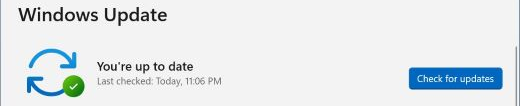
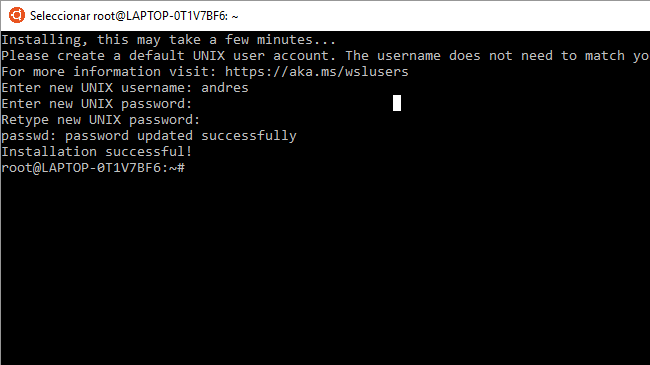

# Development Environment in Windows

Development Environment Setup on Windows **(only for Windows 11)**. 

This repository contains the following explanatory syllabus to prepare and configure the Windows 11 operating system in a development environment with WSL, follow the instructions to configure.

- [Install development tools](#install-development-tools)
    1. [Setup Windows Terminal and PowerShell](#setup-windows-terminal-and-powershell)
    2. [Install winget](#install-winget)
    3. [Run script to install development tools](#run-script-to-install-development-tools)

- [Install WSL with Ubuntu](#install-wsl-with-ubuntu)
    1. [Install Windows updates](#install-windows-updates)
    2. [Install WSL](#install-wsl)
    3. [Install Ubuntu updates](#install-ubuntu-updates)
    4. [Install dependencies and utilities](#install-dependencies-and-utilities)
    5. [Install development environment](#install-development-environment)
   
- [Install postgreSQL and connect with pgAdmin](#install-postgresql-and-connect-with-pgAdmin)
    1. [Install postgreSQL](#install-postgresql)
    2. [Connect postgresql with pgAdmin](#connect-postgresql-with-pgadmin)
    

## Install development tools

1. ### Setup Windows Terminal and PowerShell

    Install the **Windows Terminal** and **PowerShell** from the **Microsoft Store**. If you have the 2 applications installed, you just have to make sure they are updated.

    
    

2. ### Install winget

    Install or update the ***winget*** package from the **Microsoft Store**, this tool is essential to run the script that will install the development tools.

    

3. ### Run script to install development tools

    To install the development tools we must open the PowerShell terminal as an administrator user and execute the following commands:

    ```powershell
    #Command to download the script:
    Invoke-RestMethod -Uri https://raw.githubusercontent.com/stevenfvg/prework-setup-windows/main/scripts/installDevTools.ps1 -OutFile "C:\Users\$env:USERNAME\Downloads\installDevTools.ps1"

    # Access the Downloads directory:
    cd C:\Users\$env:USERNAME\Downloads\

    # We run the script:
    ./installDevTools.ps1
    ```
    Once the script execution process is complete, you will have the following programs installed on your computer:
    
    - [Google Chrome developer edition browser](https://www.google.com/intl/es_us/chrome/dev/).
    - [Mozilla Firefox developer edition browser](https://www.mozilla.org/es-CL/firefox/developer/).
    - [Visual Studio Code](https://code.visualstudio.com/).
    - [Postman](https://www.postman.com/downloads/).
    - [pgAdmin](https://www.pgadmin.org/download/pgadmin-4-windows/).

    **[⬆ Back to top](#development-environment-in-windows)**

## Install WSL with Ubuntu

 1. ### Install Windows updates

    Verify that your Windows system is updated to install WSL.

    Go to the **Settings** window > **Windows Update** if there are pending updates to install, run the installation and restart your system to continue.

    

 2. ### Install WSL

    To install Linux on Windows we must open the ***PowerShell*** command line and type the following command (it is not necessary to open the terminal as an administrator user):

    ```powershell
    wsl --install
    ```
    This command will enable the features necessary to run WSL and install the **Ubuntu** Linux distribution. [(go to the official Microsoft documentation for more information)](https://learn.microsoft.com/en-us/windows/wsl/install).

    At the end of the installation you must restart the system to take the changes, enter the following command:

    ```powershell
    Restart-Computer -Force
    ```    
    When you start the computer you will notice that the Ubuntu terminal will start automatically so it will ask you to enter your username and password.

    

    Enter the following command to remove the Ubuntu welcome message every time you start the terminal:

    ```bash
    touch .hushlogin
    ```

 3. ### Install Ubuntu updates

    ```bash
    sudo apt -y update && sudo apt -y upgrade 
    ```

4. ### Install dependencies and utilities:

    ```bash
    sudo apt -y install wget unzip tar unrar p7zip-full && sudo snap install curl
    ```

5. ### Install development environment

    Run the following command to download the development environment setup script to the Ubuntu terminal:

    ```bash
    curl -L https://raw.githubusercontent.com/stevenfvg/prework-setup-windows/main/scripts/setupDev-wsl.sh -O && chmod +x setupDev-wsl.sh
    ```
    Run the script to start the installation and configuration process:

    ```bash
    ./setupDev-wsl.sh
    ```
    This script performs various tasks such as installing Vim text editor, Node.js, npm, Python, Git and configuring Git with your username and email. It also generates an SSH key pair for use with GitHub.
    Wait for the installation process to finish and enter the following command line to add the ***commitlint*** configuration:

    ```bash
    echo "module.exports = {extends: ['@commitlint/config-conventional']}" > commitlint.config.js
    ```

    **Note**: Don't forget to add your ***SSH*** public key to your **GitHub** configuration for added security when cloning repositories and pushing changes from your local **Git** server to the remote server.

    **[⬆ Back to top](#development-environment-in-windows)**

## Install postgreSQL and connect with pgAdmin

 1. ### Install postgreSQL
    
    Open Ubuntu terminal and run the following commands to install ***postgresql***:

    ```bash
    # Create the file repository configuration:
    sudo sh -c 'echo "deb https://apt.postgresql.org/pub/repos/apt $(lsb_release -cs)-pgdg main" > /etc/apt/sources.list.d/pgdg.list'

    # Import the repository signing key:
    wget --quiet -O - https://www.postgresql.org/media/keys/ACCC4CF8.asc | sudo apt-key add -
    
    # Update the package lists:
    sudo apt-get update

    # Install the latest version of PostgreSQL.
    # If you want a specific version, use 'postgresql-12' or similar instead of 'postgresql':
    sudo apt-get -y install postgresql
    ```
    At the end of the installation, enter the ***postgresql*** command line:

    ```bash
    sudo -u postgres psql
    ```

    Now we will create a username and password for the database configuration:

    ```sql
    CREATE ROLE user PASSWORD 'password' SUPERUSER CREATEDB CREATEROLE INHERIT LOGIN;
    ```

    **Important**: change the word ***user*** with your ***username*** and the word ***password*** with the ***password*** of your preference inside the single quotes.

    To exit the postgresql command line use the syntax `\q`
 
 2. ### Connect postgresql with pgAdmin


<!-- 
2. ### Install Oh My Posh

    Open the **PowerShell** terminal and enter the following command:

    ```powershell
    winget install JanDeDobbeleer.OhMyPosh -s winget
    ```
3. ### Install fonts for terminal

    The following command must be run as administrator for the fonts to be installed system-wide. **In case you do not have administrator rights, you can install the sources by adding the --user flag**.

    ```powershell
    oh-my-posh font install
    ```
    Once you have installed a Nerd Font, you will need to configure the Windows Terminal to use it. This can be easily done by modifying the Windows Terminal settings (default shortcut: **CTRL + SHIFT + ,**). In your settings.json file, add the font.face attribute under the defaults attribute in profiles:

    ```json
    {
        "profiles":
        {
            "defaults":
            {
                "font": 
                {
                    "face": "FiraCode Nerd Font Mono"
                }
            }
        }
    }
    ```
4. ### Start Oh My Posh with default theme

    For initialization of **Oh My Posh** enter the following command. 
    
    ```powershell
    oh-my-posh init pwsh --config "$env:POSH_THEMES_PATH\jandedobbeleer.omp.json"

    # command line output
    (@(& 'C:/Users/st3ve/AppData/Local/Programs/oh-my-posh/bin/oh-my-posh.exe' init pwsh --config='C:\Users\st3ve\AppData\Local\Programs\oh-my-posh\themes\jandedobbeleer.omp.json' --print) -join "`n") | Invoke-Expression
    ```
    Copy the output of the command to the following configuration file: 

    ```powershell
    notepad $PROFILE
    ```
    If Notepad displays a pop-up window displaying the following message *"The system cannot find the path specified"*. Enter the following command to create the configuration file:

    ```powershell
    New-Item -Path $PROFILE -Type File -Force
    ```

    Repeat the `notepad $PROFILE` command to open the configuration file.

    Add the output of the command `oh-my-posh init pwsh --config "$env:POSH_THEMES_PATH\jandedobbeleer.omp.json"` to the configuration file `$PROFILE` save the changes and restart the terminal to start Oh My Posh.

5. ### Set Theme in Oh My Posh     

    In this case the default theme "jandedobbeleer.omp.json" is being used. You can choose the one you prefer, consult the [Oh My Posh documentation](https://ohmyposh.dev/docs/themes) to see the list of themes.

    You can also see the list of topics from ***PowerShell*** with the command:

    ```powershell
    Get-PoshThemes
    ```
    To change the theme just change the name of the theme from the `$PROFILE` configuration file.

    ```powershell
    # Open the configuration file
    notepad $PROFILE

    # Change only the name of the theme in the following line:
    (@(& 'C:/Users/st3ve/AppData/Local/Programs/oh-my-posh/bin/oh-my-posh.exe' init pwsh --config='C:\Users\st3ve\AppData\Local\Programs\oh-my-posh\themes\"new theme name".omp.json' --print) -join "`n") | Invoke-Expression

    # Example:
    (@(& 'C:/Users/st3ve/AppData/Local/Programs/oh-my-posh/bin/oh-my-posh.exe' init pwsh --config='C:\Users\st3ve\AppData\Local\Programs\oh-my-posh\themes\pure.omp.json' --print) -join "`n") | Invoke-Expression
    ```
6. ### Install Terminal Icons and enable PSReadLine module

    Install the icon module for the terminal with the following command:

    ```powershell
    Install-Module -Name Terminal-Icons -Repository PSGallery

    # then add option [A] to accept.
    ```
    We add the following lines to the end of the terminal `$PROFILE` file to import the Terminal-Icons module and enable the PSReadLine.

    ```powershell
    Import-Module Terminal-Icons
    Set-PSReadLineOption -PredictionViewStyle ListView
    ```
    To finish, save the changes `Ctrl+S` and restart the terminal.
    
**[⬆ Back to top](#development-environment-in-windows)**

->
