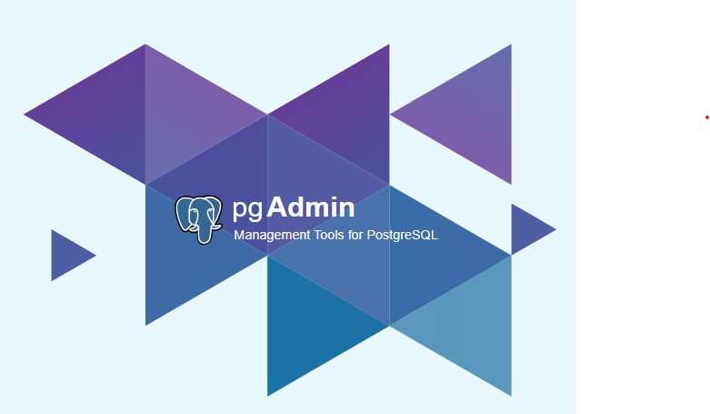
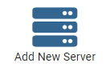
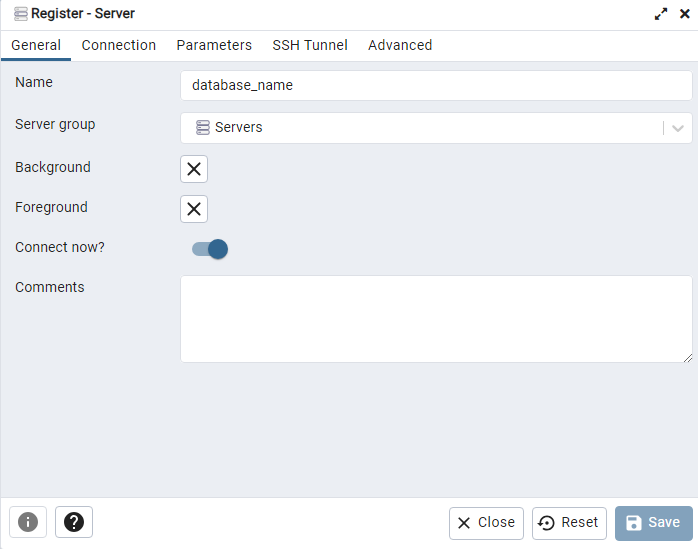
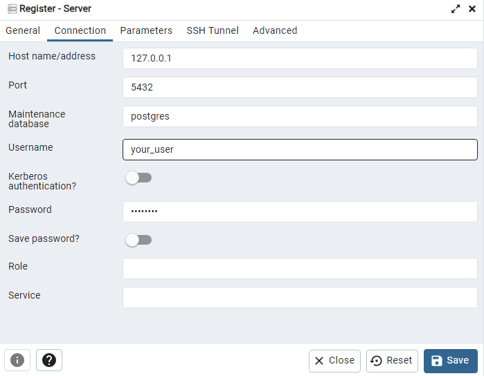

# Entorno de Desarrollo en Windows

Configuración del Entorno de Desarrollo en Windows **(solo para Windows 11)**. 

Este repositorio está diseñado para simplificar la configuración inicial de un entorno de desarrollo en Windows 11, permitiéndote programar en **Python**, **Node.js** y crear bases de datos con **PostgreSQL**. Además, incluye instrucciones para instalar ***Windows Subsystem for Linux (WSL)***, brindándote la flexibilidad de trabajar en un entorno de Linux en tu sistema Windows. Nuestra guía detallada te ayudará a instalar las herramientas esenciales y configurar tu sistema para que estés listo para codificar y desarrollar proyectos de software de manera eficiente.

<details>
    <summary>Mostrar tabla de contenidos</summary>

## Tabla de Contenidos

- [Instalar herramientas de desarrollo](#instalar-herramientas-de-desarrollo)
    1. [Configurar Windows Terminal y PowerShell](#configurar-windows-terminal-y-powershell)
    2. [Instalar winget](#instalar-winget)
    3. [Ejecutar script para instalar herramientas de desarrollo](#ejecutar-script-para-instalar-herramientas-de-desarrollo)

- [Instalar WSL con Ubuntu](#instalar-wsl-con-ubuntu)
    1. [Instalar actualizaciones de Windows](#instalar-actualizaciones-de-windows)
    2. [Instalar WSL](#instalar-wsl)
    3. [Instalar actualizaciones de Ubuntu](#instalar-actualizaciones-de-ubuntu)
    4. [Instalar dependencias y utilidades](#instalar-dependencias-y-utilidades)
    5. [Instalar entorno de desarrollo](#instalar-entorno-de-desarrollo)
   
- [Instalar PostgreSQL y conectar con pgAdmin](#instalar-postgresql-y-conectar-con-pgadmin)
    1. [Instalar PostgreSQL](#instalar-postgresql)
    2. [Conectar PostgreSQL con pgAdmin](#conectar-postgresql-con-pgadmin)

- [Personalizar Windows Terminal con Oh My Posh (opcional)](#personalizar-windows-terminal-con-oh-my-posh-optional)
    1. [Instalar Oh My Posh](#instalar-oh-my-posh)
    2. [Instalar fuentes para el terminal](#instalar-fuentes-para-el-terminal)
    3. [Iniciar Oh My Posh con el tema predeterminado](#iniciar-oh-my-posh-con-el-tema-predeterminado)
    4. [Establecer un tema en Oh My Posh](#establecer-un-tema-en-oh-my-posh)
    5. [Instalar iconos de terminal y habilitar el módulo PSReadLine](#instalar-iconos-de-terminal-y-habilitar-el-módulo-psreadline)

</details>

## Instalar herramientas de desarrollo

1. ### Configurar Windows Terminal y PowerShell

    Instala el **Windows Terminal** y **PowerShell** desde la **Tienda Microsoft**. Si ya tienes estas dos aplicaciones instaladas, asegúrate de que estén actualizadas.

    
    

2. ### Instalar winget

    Instala o actualiza el paquete ***winget*** desde la **Tienda Microsoft**, esta herramienta es esencial para ejecutar el script que instalará las herramientas de desarrollo.

    

3. ### Ejecutar script para instalar herramientas de desarrollo

    Para instalar las herramientas de desarrollo, debemos abrir la terminal de PowerShell como administrador y ejecutar los siguientes comandos:

    ```powershell
    # Comando para descargar el script:
    Invoke-RestMethod -Uri https://raw.githubusercontent.com/stevenfvg/prework-setup-windows/main/scripts/installDevTools.ps1 -OutFile "C:\Users\$env:USERNAME\Downloads\installDevTools.ps1"

    # Accede al directorio de Descargas:
    cd C:\Users\$env:USERNAME\Downloads\

    # Ejecutamos el script:
    ./installDevTools.ps1
    ```
    Una vez que se complete el proceso de ejecución del script, tendrás los siguientes programas instalados en tu computadora:

    - [Navegador Google Chrome Developer Edition](https://www.google.com/intl/es_us/chrome/dev/).
    - [Navegador Mozilla Firefox Developer Edition](https://www.mozilla.org/es-CL/firefox/developer/).
    - [Visual Studio Code](https://code.visualstudio.com/).
    - [Postman](https://www.postman.com/downloads/).
    - [pgAdmin](https://www.pgadmin.org/download/pgadmin-4-windows/).

    **[⬆ Volver al inicio](#entorno-de-desarrollo-en-windows)**

## Instalar WSL con Ubuntu

 1. ### Instalar actualizaciones de Windows

    Verifica que tu sistema Windows esté actualizado para instalar WSL.

    Ve a la ventana de **Configuración** > **Actualización de Windows** y, si hay actualizaciones pendientes para instalar, ejecuta la instalación y reinicia tu sistema para continuar.

    

 2. ### Instalar WSL

    Para instalar Linux en Windows, debemos abrir la línea de comandos de ***PowerShell*** y escribir el siguiente comando (no es necesario abrir la terminal como administrador):

    ```powershell
    wsl --install
    ```
    Este comando habilitará las características necesarias para ejecutar WSL e instalar la distribución de Linux **Ubuntu**. [(consulta la documentación oficial de Microsoft para obtener más información)](https://learn.microsoft.com/en-us/windows/wsl/install).

    Al finalizar la instalación, debes reiniciar el sistema para aplicar los cambios, ejecuta el siguiente comando:

    ```powershell
    Restart-Computer -Force
    ```    
    Cuando inicies el equipo, notarás que el terminal de Ubuntu se iniciará automáticamente y te pedirá que ingreses tu nombre de usuario y contraseña.

    

    Ingresa el siguiente comando para eliminar el mensaje de bienvenida de Ubuntu cada vez que inicies el terminal:

    ```bash
    touch .hushlogin
    ```

 3. ### Instalar actualizaciones de Ubuntu

    ```bash
    sudo apt -y update && sudo apt -y upgrade 
    ```

4. ### Instalar dependencias y utilidades:

    ```bash
    sudo apt -y install wget unzip tar unrar p7zip-full && sudo snap install curl
    ```

5. ### Instalar entorno de desarrollo

    Ejecuta el siguiente comando para descargar el script de configuración del entorno de desarrollo en el terminal de Ubuntu:

    ```bash
    curl -L https://raw.githubusercontent.com/stevenfvg/prework-setup-windows/main/scripts/setupDev-wsl.sh -O && chmod +x setupDev-wsl.sh
    ```
    Ejecuta el script para iniciar el proceso de instalación y configuración:

    ```bash
    ./setupDev-wsl.sh
    ```
    Este script realiza diversas tareas, como la instalación del editor de texto Vim, Node.js, npm, Python, Git y la configuración de Git con tu nombre de usuario y correo electrónico. También genera un par de claves SSH para su uso con GitHub. Espera a que termine el proceso de instalación e ingresa el siguiente comando para agregar la configuración de ***commitlint***:

    ```bash
    echo "module.exports = {extends: ['@commitlint/config-conventional']}" > commitlint.config.js
    ```

    **Nota**: No olvides agregar tu clave pública ***SSH*** a la configuración de **GitHub** para una mayor seguridad al clonar repositorios y enviar cambios desde tu servidor local de **Git** al servidor remoto.

    **[⬆ Volver al inicio](#entorno-de-desarrollo-en-windows)**

## Instalar PostgreSQL y conectar con pgAdmin

 1. ### Instalar PostgreSQL
    
    Abre el terminal de Ubuntu y ejecuta los siguientes comandos para instalar ***PostgreSQL***:

    ```bash
    # Crea la configuración del repositorio de archivos:
    sudo sh -c 'echo "deb https://apt.postgresql.org/pub/repos/apt $(lsb_release -cs)-pgdg main" > /etc/apt/sources.list.d/pgdg.list'

    # Importa la clave de firma del repositorio:
    wget --quiet -O - https://www.postgresql.org/media/keys/ACCC4CF8.asc | sudo apt-key add -
    
    # Actualiza las listas de paquetes:
    sudo apt-get update

    # Instala la última versión de PostgreSQL.
    # Si deseas una versión específica, utiliza 'postgresql-12' u otra en lugar de 'postgresql':
    sudo apt-get -y install postgresql
    ```
    Al finalizar la instalación, entra en la línea de comandos de ***PostgreSQL***:

    ```bash
    sudo -u postgres psql
    ```

    Ahora vamos a crear un nombre de usuario y una contraseña para la configuración de la base de datos:

    ```sql
    CREATE ROLE usuario PASSWORD 'contraseña' SUPERUSER CREATEDB CREATEROLE INHERIT LOGIN;
    ```

    **Importante**: cambia la palabra ***usuario*** por tu ***nombre de usuario*** y la palabra ***contraseña*** por la ***contraseña*** de tu elección dentro de las comillas simples.

    Para salir de la línea de comandos de PostgreSQL, usa la sintaxis `\q`.

 2. ### Conectar PostgreSQL con pgAdmin
    
    Para iniciar la conexión de PostgreSQL con el entorno gráfico, abre la aplicación ***pgAdmin4***.

    <div style="text-align:center">
        
    </div>

    Al iniciar pgAdmin, debes realizar la conexión con PostgreSQL agregando un nuevo servidor:

    <div style="text-align:center">
        
    </div>

    En la ventana de ***Registrar servidor***, en la pestaña ***General***, debes agregar un nombre, por ejemplo:

    <div style="text-align:center">
        
    </div>

    Luego, en la ventana de Conexión, agrega el nombre de host de tu computadora ***127.0.0.1*** seguido del ***nombre de usuario*** y ***contraseña*** que creaste en la línea de comandos de **PostgreSQL**:

    <div style="text-align:center">
        
    </div>

    Para finalizar la configuración, presiona el botón ***Guardar***.

    **Nota importante**: debes mantener la dirección ***127.0.0.1*** y el puerto ***5432*** que aparecen en la imagen.

    **[⬆ Volver al inicio](#entorno-de-desarrollo-en-windows)**

## Personalizar Windows Terminal con Oh My Posh (opcional)

 1. ### Instalar Oh My Posh

    Abre la terminal de **PowerShell** y ejecuta el siguiente comando:

    ```powershell
    winget install JanDeDobbeleer.OhMyPosh -s winget
    ```

 2. ### Instalar fuentes para el terminal

    Debes ejecutar el siguiente comando como administrador para que las fuentes se instalen en todo el sistema. **Si no tienes derechos de administrador, puedes instalar las fuentes agregando la bandera --user**.

    ```powershell
    oh-my-posh font install
    ```
    Una vez que hayas instalado una fuente Nerd Font, debes configurar el Windows Terminal para usarla. Esto se puede hacer fácilmente modificando la configuración de Windows Terminal (atajo predeterminado: **CTRL + SHIFT + ,**). En tu archivo settings.json, agrega el atributo font.face dentro del atributo defaults en profiles:

    ```json
    {
        "profiles":
        {
            "defaults":
            {
                "font": 
                {
                    "face": "FiraCode Nerd Font Mono"
                }
            }
        }
    }
    ```
 3. ### Iniciar Oh My Posh con el tema predeterminado

    Para la inicialización de **Oh My Posh**, ingrese el siguiente comando:

    ```powershell
    oh-my-posh init pwsh --config "$env:POSH_THEMES_PATH\jandedobbeleer.omp.json"

    # Salida en la línea de comandos
    (@(& 'C:/Users/st3ve/AppData/Local/Programs/oh-my-posh/bin/oh-my-posh.exe' init pwsh --config='C:\Users\st3ve\AppData\Local\Programs\oh-my-posh\themes\jandedobbeleer.omp.json' --print) -join "`n") | Invoke-Expression
    ```
    Copie la salida del comando al siguiente archivo de configuración:

    ```powershell
    notepad $PROFILE
    ```
    Si Notepad muestra una ventana emergente con el siguiente mensaje *"El sistema no puede encontrar la ruta especificada"*, ingrese el siguiente comando para crear el archivo de configuración:

    ```powershell
    New-Item -Path $PROFILE -Type File -Force
    ```

    Repita el comando `notepad $PROFILE` para abrir el archivo de configuración.

    Agregue la salida del comando `oh-my-posh init pwsh --config "$env:POSH_THEMES_PATH\jandedobbeleer.omp.json"` al archivo de configuración `$PROFILE`, guarde los cambios y reinicie la terminal para iniciar Oh My Posh.

4. ### Establecer un tema en Oh My Posh

    En este caso, se está utilizando el tema predeterminado "jandedobbeleer.omp.json". Puede elegir el que prefiera, consulte la [documentación de Oh My Posh](https://ohmyposh.dev/docs/themes) para ver la lista de temas disponibles.

    También puede ver la lista de temas desde ***PowerShell*** con el siguiente comando:

    ```powershell
    Get-PoshThemes
    ```
    Para cambiar el tema, simplemente cambie el nombre del tema en el archivo de configuración `$PROFILE`.

    ```powershell
    # Abra el archivo de configuración
    notepad $PROFILE

    # Cambie solo el nombre del tema en la siguiente línea:
    (@(& 'C:/Users/st3ve/AppData/Local/Programs/oh-my-posh/bin/oh-my-posh.exe' init pwsh --config='C:\Users\st3ve\AppData\Local\Programs\oh-my-posh\themes\"nuevo nombre del tema".omp.json' --print) -join "`n") | Invoke-Expression

    # Ejemplo:
    (@(& 'C:/Users/st3ve/AppData/Local/Programs/oh-my-posh/bin/oh-my-posh.exe' init pwsh --config='C:\Users\st3ve\AppData\Local\Programs\oh-my-posh\themes\pure.omp.json' --print) -join "`n") | Invoke-Expression
    ```
5. ### Instalar Iconos de Terminal y habilitar el módulo PSReadLine

    Instale el módulo de iconos para el terminal con el siguiente comando:

    ```powershell
    Install-Module -Name Terminal-Icons -Repository PSGallery

    # luego agregue la opción [A] para aceptar.
    ```
    Agregamos las siguientes líneas al final del archivo `$PROFILE` del terminal para importar el módulo Terminal-Icons y habilitar PSReadLine.

    ```powershell
    Import-Module Terminal-Icons
    Set-PSReadLineOption -PredictionViewStyle ListView
    ```
    Para finalizar, guarde los cambios con `Ctrl+S` y reinicie la terminal.

    **[⬆ Volver al inicio](#entorno-de-desarrollo-en-windows)**
